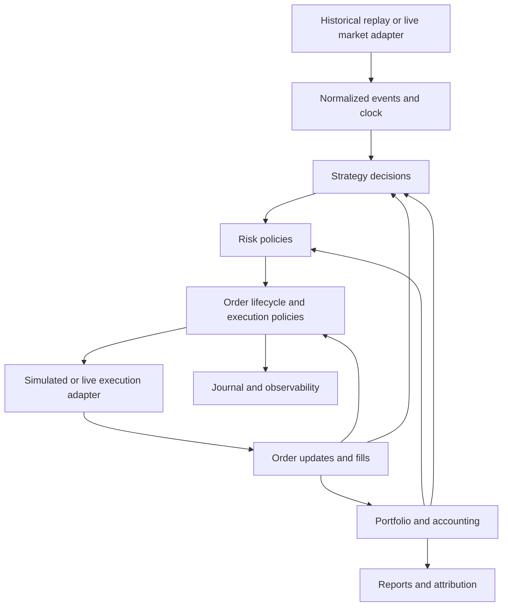

# Stolgo: gaps toward a generic backtesting and deployment library

Date: 2026-09-13. Audited checkout: `efdc991`, including the existing working-tree changes. This is a code audit and proposed roadmap, not an implementation or live-readiness certification.

Inputs: current Stolgo source, tests, HLD, and the supplied [SENSEX ATM live MVP plan](SENSEX_ATM_STRADDLE_LIVE_MVP_PLAN.md). Bandl's implementation was not independently re-audited here; its transport findings in that plan remain upstream validation items. No broker account was accessed.

## Assessment

Stolgo has a useful foundation for single-symbol, bar-based research: a small Strategy API, NumPy history views, price-action composition, historical data normalization/cache, simulated orders, parameter sweeps, and report/UI artifacts. Module boundaries already separate much of the relevant functionality.

It does not yet provide a general portfolio backtester or a functioning live/paper runtime. Some declared interfaces and documented features are incomplete, and several existing simulation/accounting paths have correctness defects.

The SENSEX straddle should become a reference strategy that exercises reusable capabilities. Building its execution and accounting as another standalone strategy-specific simulator would make the immediate example work while leaving the library's main gap unresolved.

The product promise should be: **write strategy decisions against stable, broker-independent contracts; reuse them in historical replay, live-data paper execution, and supported live deployments.** Identical supplied events and configuration should produce equivalent strategy decisions. Historical and live fills, latency, available information, and resulting P&L can differ; that difference must be observable.

## 1. Existing correctness gaps to fix first

These were checked with small synthetic offline inputs, in addition to source inspection.

| Gap | Current evidence and reproduced behavior | Required correction |
|---|---|---|
| Short trade accounting | [trades.py](../lib/stolgo/report/trades.py), `build_trades_from_fills`, matches sells against earlier buys only. A sell-then-buy round trip ends flat with two fills and **zero trade rows**. | Signed long/short lot accounting; partial closes, reversals, per-instrument matching, fee attribution, explicit open inventory. |
| Position average cost | [portfolio.py](../lib/stolgo/portfolio/portfolio.py), `apply_fill`, leaves average entry at zero after opening a short at 100. | Correct average cost and realized/unrealized P&L through short entries, additions, reductions, reversals, and flat transitions. |
| Close-fill timing | [engine.py](../lib/stolgo/core/engine.py) matches before the strategy callback. A bar-0 signal with close 104 fills at bar-1 close 114 under `fill_on="close"`. | Define event phases and implement the documented timing contract. Same-bar-close simulation also needs explicit information/execution assumptions. |
| Risk can block exits | [risk.py](../lib/stolgo/portfolio/risk.py) rejects every intent after a hardcoded 50% peak drawdown. A buy intended to close a short is rejected at 60% drawdown. | Distinguish added risk from validated exposure reduction, accounting for pending orders. Risk breach must enable exit-only behavior rather than suppress all orders. |
| Incorrect stop simulation | [order_book.py](../lib/stolgo/oms/order_book.py) fills a buy stop triggered at 110 at the bar open of 100, even though that open preceded the trigger. | Gap-aware trigger/fill logic with explicit intrabar ambiguity rules. |
| Stop-limit is declared but not implemented | `OrderType.STOP_LIMIT` is accepted into the order book but has no matching branch; a bar crossing both trigger and limit produces no fill. | Persistent triggered state followed by limit matching; document uncertainty where OHLC cannot establish event order. |
| Annualization ignores elapsed time | [metrics.py](../lib/stolgo/report/metrics.py) treats the number of samples as trading days and uses 252 for return scaling. Identical values on minute and daily timestamps produce identical CAGR. | Explicit initial capital, elapsed-time CAGR, declared return sampling/calendar conventions for risk statistics, and separate handling of irregular/session-only observations. |
| Pipeline runner is broken | [pipeline.py](../lib/stolgo/signals/pipeline.py), `run`, calls `set_index("timestamp")` after normalization has already made timestamps the index. A normalized DataFrame source raises `KeyError`. | Repair ingestion and test the public runner. Its weight-return calculation also needs a documented relationship to the execution engine. |
| Callback information boundaries | `on_start` receives all future bars; `on_fill` receives a context whose bar index is still the previous bar's. Both were reproduced. | Separate full-history vector preparation from causal runtime initialization. Give fill callbacks an event-appropriate clock/history view without exposing an unfinished bar's future close. |

Additional source findings:

- `Context.buy/sell` expose market orders only. The engine's `create_order` call drops intent limit/stop prices and tags, and uses the run symbol rather than intent identity. Having fields in `OrderIntent` does not make those capabilities usable end to end.
- `trade.long/short` calculate brackets from the signal close. `bracket_hit` detects a bar-range touch, after which `close` submits a market intent. These helpers are not actual resting protective orders; sizing also defaults to a separate 100,000 cash argument rather than current account equity.
- The engine returns an empty signals table and fill events only. Rejected intents, accepted orders, cancellation decisions, and end-of-data pending orders are not a complete auditable result.
- Reported R-multiple in the generic trade builder uses entry notional as the denominator, rather than the trade's defined initial risk. Strategy-specific R analytics elsewhere do not repair that generic path.
- Normalization checks missing values, positive prices, ordering, and duplicate timestamps, but lacks complete finite-value, OHLC-consistency, and negative-volume validation. Naive timestamps are interpreted as UTC; provider-local input needs an explicit timezone contract.

These findings are not a re-audit of the historical SENSEX run's performance. Existing run artifacts alone do not establish which simulator produced them or prove generic-engine capability.

## 2. Reusable capabilities exposed by the SENSEX use case

| Capability | Current Stolgo state | What SENSEX needs | Generic library abstraction |
|---|---|---|---|
| Instrument identity | Symbols are strings; no contract model in core. | Distinct spot, CE, and PE; exact expiry/strike; valid lots and ticks. | Instrument ID plus versioned metadata: venue, asset type, currency, underlying, expiry, strike, option right, quantity increment, multiplier, settlement convention, and native adapter mapping. |
| Multiple data streams | Engine consumes one OHLCV frame. | Spot signal plus two independently priced option legs. | Multi-instrument subscriptions and event sequencing; explicit event/receive time, closed-bar availability, missing-data and staleness policies. |
| Portfolio accounting | One `Position` and a single cash balance. | Two shorts under shared allocation, combined risk, independent exits. | Position book keyed by instrument; account and strategy attribution; cash/collateral ledger; realized/unrealized P&L and asset-specific valuation. |
| Multi-leg execution | No order-group model. | Enter two legs, protect partial fills, unwind incomplete entry. | Order groups with per-leg progress, dependencies, imbalance deadlines, compensation actions, and capability-aware native basket support. Never imply atomic execution by grouping orders locally. |
| Order lifecycle | Basic pending/open/filled/cancelled enum; simulated full fills. | Ack, rejection, partial fill, pending cancel/modify/trigger, unknown outcome. | Explicit commands, acknowledgements, state transitions, cumulative quantities, immutable fills, broker-native status, correlation IDs, and deduplication. |
| Protective orders | Bar-touch bracket helper and incomplete order book. | Stops derived from actual fills; surviving leg managed separately. | Protection policy and coverage accounting; simulated/native/emulated brackets declared explicitly; safe cancel/replace and residual exit quantity. |
| Scheduling | Bar loop; `TimerEvent` type exists without a dispatched strategy timer hook. | Completed 09:20 bar, entry cutoff, expiry eligibility, timed flattening. | Injectable clocks, session calendars, timers, contract-expiry calendars, missed-event policy, and idempotent session lifecycle. |
| Risk | One hardcoded drawdown filter. | Allocated-capital loss latch, quote quality, margin, exposure, emergency exit. | Mandatory pretrade policies plus continuous portfolio/account supervision; explicit rejection reasons; persisted latches; protective exits independent of normal entry eligibility. |
| Margin and costs | Fractional cash sizing; fixed proportional fee path wired by engine. | Valid whole lots, two-leg and intermediate exposure margin, market-specific charges. | Injectable sizing, margin and fee models; live previews through capabilities; dated historical cost/margin assumptions. Premium receipts must not be treated as unrestricted buying power. |
| Live market data | Historical adapters; subscription interface is a stub. | Quotes/depth, completed bars, reconnect and stale-data handling. | Market-data adapter separate from execution adapter; subscriptions, aggregation, warmup, backfill, bounded queues, data-quality events. |
| Runtime parity | Engine constructs SimBroker directly; `RunConfig` permits only backtest; PaperBroker raises. | Replay, shadow/paper, then Zerodha live using the same decisions. | Shared strategy/risk/OMS/accounting contracts with separate simulated-clock and live supervisors, injecting market data and execution. |
| Recovery | No durable execution ledger/reconciliation service in audited packages. | Restart without duplicate entry or forgotten exposure. | Journal, snapshots, intent uniqueness, reconciliation, recovery mode, single-writer control, and schema migration. |
| Operations | Backtest CLI, exports, read-only viewer. | Preflight, arm, pause, flatten, health, incident delivery. | Optional runtime package with authenticated audited control commands, health/event interfaces and notification adapters. |

For contract selection, historical runs need the contracts and metadata that were valid **at that historical time**. Today's lot size, expiry convention, option chain, or index membership cannot silently define an old simulation.

SENSEX does not require implementing every asset class first. It does require moving multi-instrument events and portfolio accounting ahead of the HLD's current deferral of options and ticks to v2.

## 3. Architecture and ownership

Keep the existing modules where practical and introduce stable injected contracts. A rewrite is not a prerequisite; independent SENSEX-specific replacements for OMS, accounting, and risk would create a long-term maintenance problem.

The diagram is a proposed responsibility map, not an assertion that a common event bus already exists. Continuous risk also consumes market-data and health events; a journal records the other relevant events as well.

| Owner | Responsibilities |
|---|---|
| Stolgo core | Instruments, events, clocks, strategy/context contracts, portfolio/accounting, order lifecycle, execution policies, mandatory risk, simulation and replay. |
| Stolgo extensions | Options selection/analytics, cost and margin models, market calendars, data/broker adapters, journal backends, reports, and notification implementations. |
| Bandl / broker adapter | Authentication, native symbols, request encoding, safe mutation transport, raw acknowledgements/status, market streams, account/order/fill snapshots, broker capabilities and margin endpoint access. |
| Strategy definition | ATM same-strike selection, expiry-session eligibility, two equal short legs, entry/time exit, stop rule, no reentry. Exact times, ratios, thresholds and allocation belong to versioned strategy/risk configuration. |
| Deployment example | Cloud/VPS choice, static egress, secrets, supervisor, managed DB, external heartbeat service, operator access and runbooks. |

Do not make AWS, PostgreSQL, Telegram, PagerDuty, Zerodha, or SENSEX mandatory core dependencies. A local research user should need none of their credentials. A live deployment can require a validated durable backend and operational profile.

The current `BrokerAdapter` mixes bar subscriptions with trading. Split data and execution contracts so that one provider can supply data while another executes. Inject adapters directly first; packaged entry-point discovery can follow once the contracts are exercised.

Adapter capabilities must describe native/emulated/unsupported order behavior, usable instruments/products, timestamp quality, margin access, and recovery facilities. Fail preflight with a clear unsupported-capability error rather than silently changing strategy economics.

Kite documents that a submission acknowledgement does not establish execution, and that its order history is available for the day. Those semantics support a durable Stolgo order/fill ledger and reconciliation; a `place_order() -> str` interface alone is insufficient. [Kite order documentation](https://kite.trade/docs/connect/v3/orders/).

Kite also exposes depth/order updates over WebSocket and separate order/basket margin endpoints. Stolgo needs normalized adapter surfaces for these capabilities; an OHLCV source and account balance method do not cover them. [Kite WebSocket documentation](https://kite.trade/docs/connect/v3/websocket/), [Kite margin documentation](https://kite.trade/docs/connect/v3/margins/).

## 4. Gaps beyond this one strategy

To support other strategy families credibly, define an explicit supported-capability matrix and extension points for:

- **Portfolio strategies:** pairs, baskets, target weights, rebalancing, shared capital, pending exposure, and strategy-level attribution within an account. The current Pipeline computes weights and a return series separately from order execution; it is not a multi-asset OMS.
- **Instrument lifecycle:** corporate actions and delistings for equities; expiry, exercise/assignment and settlement for supported options; rollover and variation margin for futures; funding and contract valuation for supported perpetuals; currency conversion when supported. Implement and certify each profile incrementally.
- **Point-in-time research data:** historical universes/contracts, adjustment policy, source revisions and checksums, missing sessions/contracts with reason codes. Option Greeks and IV can be optional inputs/models rather than prerequisites for an ATM selection example.
- **Execution realism:** bid/ask-aware fills, latency, volume/partial fills, gap behavior, auction/session boundaries, rejected orders, borrow constraints where relevant, and explicit simulation fidelity levels. OHLC cannot reconstruct every intrabar path.
- **Validation:** walk-forward and out-of-sample partitions, leakage checks, parameter robustness, reproducible seeds and recorded configuration. Grid search alone is not a validation methodology.
- **Comparable results:** initial capital baseline, real timestamps, open positions, fees/funding/settlement, per-leg and strategy P&L, risk decisions, skipped opportunities, and execution-quality comparison between replay and live.

The existing standalone `parabolic_short.py` has its own `simulate_trade`/`backtest_symbol` functions. This is useful research code, but demonstrates why adding strategy-specific simulators does not automatically broaden the common engine. Future reference strategies should exercise the shared execution and accounting path.

## 5. Open-source adoption gaps

Broad adoption requires reliable contracts and contributor experience, not only more trading features.

1. **Publish an accurate support matrix.** Mark each capability implemented, experimental, planned, or unsupported. README/HLD descriptions currently outpace implementation in several places, including close fills, paper mode and plugin extensibility.
2. **Consolidate package metadata.** `pyproject.toml` says 0.2.0/Python 3.10+, while `setup.py` carries 0.1.2.post1 and older descriptions/classifiers/dependencies. Verify built wheel/sdist contents and clean installs from one canonical configuration.
3. **Provide a green default test command.** The current standard invocation fails during collection. No GitHub Actions workflow was found in the audited checkout; add automated supported-Python tests, package-build/install checks and offline adapter contract tests.
4. **Stabilize extension interfaces.** The engine hardcodes broker/fill/slippage/fee/risk construction despite some protocols existing. Let users inject implementations and document their behavioral contracts, serialization/versioning and compatibility policy.
5. **Make research reproducible.** Existing manifests contain parameters and metrics but need code/strategy version, data identity, calendar/contract snapshot, model versions and provenance. `RunResult.events` currently does not amount to a persisted replay journal.
6. **Support contributors.** Add standalone contributing/development guidance, adapter author guide, changelog/deprecation policy, release process and security-reporting guidance. Keep examples executable in CI with bundled/licensable offline fixtures.
7. **Use varied reference strategies as acceptance tests.** A single-symbol breakout, SENSEX straddle, pairs trade and periodic rebalance should share core accounting/execution. This provides evidence of generality beyond a single example.

## 6. Recommended delivery order and gates

| Stage | Deliverable | Acceptance gate |
|---|---|---|
| 0: trustworthy existing engine | Correct short/reversal accounting, fill phases, order field propagation, stops, risk exits, metrics, callback visibility and Pipeline ingestion; repair default test collection. | Small explicit expected-value regressions; quantity/cash/fee conservation; no future-dependent decisions; documented terminal open-order policy; standard offline suite passes. |
| 1: reusable domain and portfolio | Instrument metadata, multiple event streams, position book, valuation/sizing/cost policies, injected interfaces. | Spot + CE + PE replay with independent leg fills/stops and shared capital; pairs and rebalance examples use the same accounting. |
| 2: lifecycle and simulation | Stateful OMS, order groups, acknowledgements/partials/rejections, protective coverage, continuous risk, timers/calendars, paper execution. | SENSEX spec and loss overlay run in historical replay and recorded-event replay; partial leg, rejected stop and cancel/fill race fixtures reach specified terminal states. |
| 3: recoverable runtime and first live adapter | Durable journal, reconciliation, latches, recovery supervisor, safe broker transport, live quotes, margin capabilities, health/control interfaces. | Lost response/restart does not cause blind resubmission; duplicate/out-of-order updates do not double count fills; stale data does not produce fictitious zero risk; exposure remains supervised while entries are halted. |
| 4: operational SENSEX pilot | Versioned example configuration, preflight, supervised arming, monitoring, fault drills and deployment recipe. | Pass the supplied plan's shadow and supervised-canary gates with current broker/venue capabilities validated. |
| 5: OSS stabilization and broader profiles | Stable adapter SDK, support matrix, release/migration process, reproducible examples, additional tested asset profiles. | External custom strategy and adapter can run without editing engine internals; packaged install and documented examples pass automated checks. |

Stages are dependency order, not calendar estimates. Several documentation/packaging tasks can proceed earlier. The supplied plan's 10–15-day estimate concerns its constrained MVP and should not be reused as an estimate for a general-purpose OSS platform.

A convincing first milestone is: **the SENSEX straddle runs through the common engine with correct per-leg accounting and recoverable order state, while an unrelated pairs or rebalance example reuses those same abstractions.**

## 7. Verification performed

- Read the current engine, types/events/config, strategy/context, portfolio/risk/sizing, OMS, broker stubs, data interfaces/normalization/cache, Pipeline, reports, packaging, HLD and relevant tests.
- Ran `.venv/bin/python -m pytest -q`: collection failed because `tests/test_nse_option_chain.py` imports the missing `stolgo.nse_data` module.
- Ran `.venv/bin/python -m pytest -q --ignore=tests/test_nse_option_chain.py`: **99 passed, 1 skipped**. This excludes the collection blocker and is not a fully passing default suite.
- Ran synthetic in-memory probes reproducing the nine correctness rows above. Existing passing tests do not cover those semantics adequately.
- Checked official Kite orders, WebSocket and margin documentation for the adapter contract discussion. Did not verify current SENSEX contract metadata, enabled account capabilities, credentials, fees or live order behavior.
- Added this assessment only; no source fixes, strategy changes, deployments or trades were performed.
