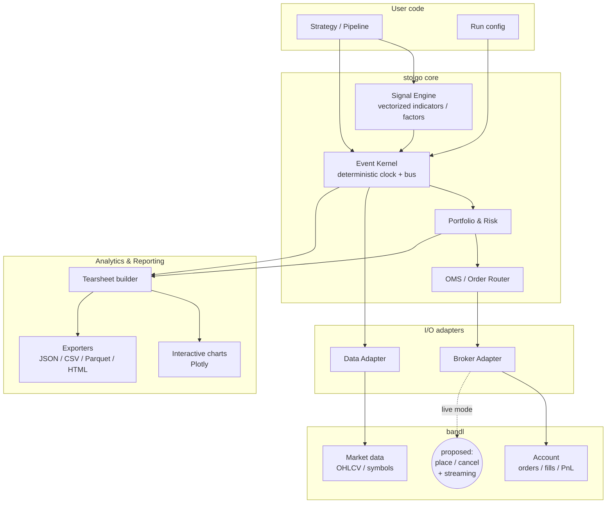
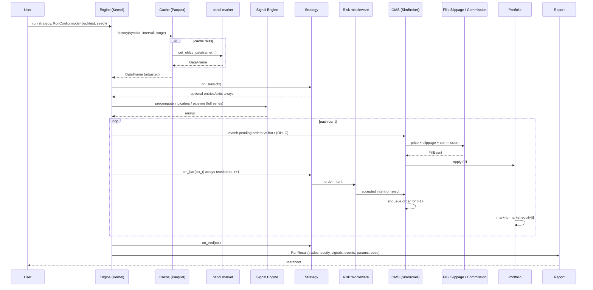
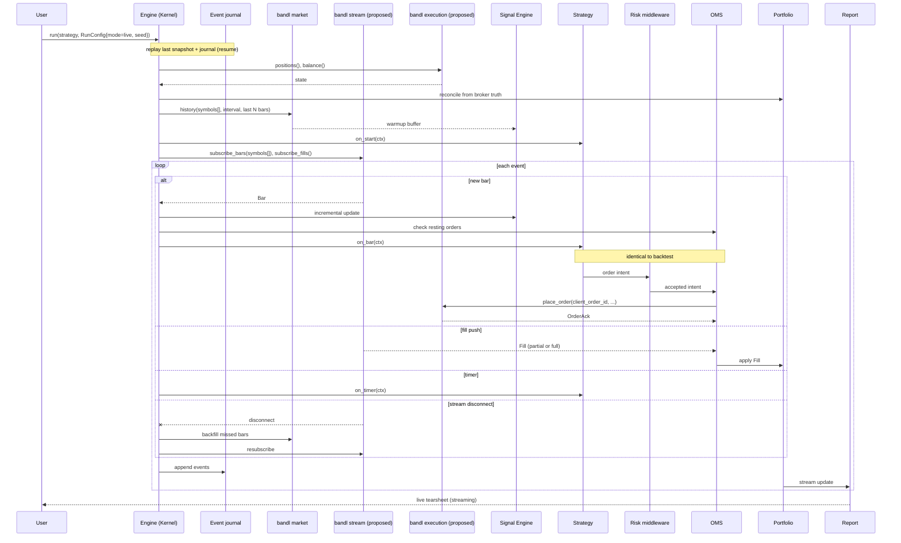

# stolgo — High-Level Architecture (HLD)

> **Status:** Greenfield design. The existing `lib/stolgo/*` code is **out of scope** and will not be referenced or migrated.
> **Scope:** High-level design only. No implementation details, no file-by-file layout, no class internals.

---

## 1. Vision

**stolgo** is a lightweight, blazing-fast, quant-grade Python framework with two equal pillars:

1. **Backtesting** — vectorized + event-driven hybrid, reproducible, fast enough for large parameter sweeps.
2. **Live trading** — the **same strategy code** that backtested yesterday runs against a live broker today.

The wedge is **sim ↔ live parity** + **price-action and quant ergonomics on Indian + crypto markets via [bandl](https://github.com/stockalgo/bandl)**.

### Cherry-picked design choices

| Library | What we steal | What we reject |
|---------|---------------|----------------|
| **Backtrader** | Clean `Strategy` lifecycle, broker abstraction, indicator composition | Heavy class hierarchy, slow loop, GPL |
| **Zipline-reloaded** | Pipeline-style factor/screen API for cross-sectional research | Bundle ingestion ceremony, US calendars, Cython build |
| **vectorbt** | Vectorized hot path, parameter grid sweeps, rich analytics objects | Pro-only features, opinionated multi-index UX |
| **Backtesting.py** | Minimal `init()`/`next()` UX, optimisation, beautiful default plot | AGPL, single-asset only, limited live story |
| **Nautilus Trader** | Deterministic event bus, **sim ↔ live parity**, OMS semantics | Rust toolchain, domain-model overhead, install size |

---

## 2. Goals & non-goals

### Goals (v1)
- New user writes a runnable strategy in **<20 lines**.
- Same `Strategy` class runs in `backtest`, `paper`, and `live` modes — no code changes.
- **Vectorized** path for signal generation and parameter sweeps (NumPy/Numba).
- **Event-driven** path for execution simulation and live trading (single deterministic loop).
- Pluggable **data sources** and **brokers** — `bandl` is the default for both.
- Quant-grade **tearsheet**: equity, drawdown, exposure, turnover, trade markers, parameter heatmap, factor attribution.
- Pure-Python install on Python 3.10+; **MIT** license; minimal hard deps (`numpy`, `pandas`, `pydantic`, `bandl`, `plotly`); Numba/Polars **optional**.

### Non-goals (v1)
- Distributed/cluster execution.
- Tick-by-tick order book reconstruction (bar-resolution first; tick later).
- Options Greeks, derivatives margining beyond simple notional.
- Built-in ML training loop (we expose hooks; users bring their own).
- Replacing bandl as the broker SDK — stolgo **uses** bandl, it does not duplicate it.

---

## 3. Component diagram



Three layers, top-down:

1. **User layer** — declarative `Strategy` (or `Pipeline`) + `RunConfig`.
2. **Core engine** — event kernel, signal engine, portfolio, OMS. Mode-agnostic.
3. **I/O adapter layer** — abstracts bandl (data + broker) and any future source/broker.
4. **Analytics layer** — consumes the same event stream the engine produced.

---

## 4. Module breakdown

> Module names are logical, not file paths. Each module owns a small, stable public surface.

### 4.1 `stolgo.core` — Event Kernel
- **Responsibility:** Drive simulated or wall-clock time. Single deterministic event bus.
- **Events:** `BarEvent`, `SignalEvent`, `OrderEvent`, `FillEvent`, `TimerEvent`, `AccountEvent`.
- **Public API:**
  - `Engine(config: RunConfig).run(strategy) -> RunResult`
  - `RunConfig(mode: Literal["backtest","paper","live"], clock, data, broker, ...)`
- **Guarantee:** identical event ordering for the same inputs and seed.

### 4.2 `stolgo.data` — Data Adapter
- **Responsibility:** Provide a uniform bar/tick stream from heterogeneous sources.
- **Sources:** `BandlDataSource` (default), `DataFrameSource` (user-supplied), `ParquetSource` (cache).
- **Caching:** transparent on-disk Parquet cache keyed by `(provider, symbol, interval, range)`.
- **Public API:**
  - `DataSource.history(symbol, interval, start, end) -> pd.DataFrame`
  - `DataSource.subscribe(symbol, interval) -> Iterator[Bar]` (live)

### 4.3 `stolgo.signals` — Signal / Factor Engine (vectorized)
- **Responsibility:** Compute indicators, patterns, factors **once, in bulk** over a DataFrame.
- **Two flavours:**
  - **Indicators** (single series): `sma`, `atr`, `donchian`, …
  - **Factors / Pipeline** (cross-sectional): screen N symbols by `momentum_12m`, `volatility_20d`, etc.
- **Hot path:** NumPy by default, Numba `@njit` when installed (opt-in via `RunConfig.fast=True`).
- **Public API:**
  - `@indicator` decorator → composable, named, plot-aware.
  - `Pipeline(...).select(top_n=...).rebalance("W-FRI")` — Zipline-style.

### 4.4 `stolgo.strategy` — Strategy API
- **Responsibility:** User-facing DSL. One class, two optional hooks.
- **Lifecycle:** `on_start(ctx) → on_bar(ctx) | on_signal(ctx) → on_fill(ctx) → on_end(ctx)`.
- **Two authoring styles** (both supported, no fork):
  - **Vector style:** declare `entries`/`exits` arrays in `on_start`, engine simulates.
  - **Event style:** decide in `on_bar` and call `ctx.buy(...)`, `ctx.sell(...)`.
- The same class works in both — vector path is automatically lifted to events for execution.

### 4.5 `stolgo.portfolio` — Portfolio & Risk
- **Responsibility:** Cash, positions, mark-to-market, exposure, risk caps.
- **Sizing models:** `FixedQty`, `PercentEquity`, `RiskPerTrade(stop_distance)`, `VolTarget(annual_vol)`.
- **Risk hooks:** `MaxDrawdownCap`, `MaxLeverage`, `PerSymbolCap` — implemented as middleware between strategy and OMS.

### 4.6 `stolgo.oms` — Order Management
- **Responsibility:** Order lifecycle, fill simulation, broker routing.
- **Order types (v1):** Market, Limit, Stop, StopLimit, OCO.
- **Fill model (backtest):** configurable — `next_open`, `close`, `vwap_window`, with commission + slippage models pluggable.
- **Live:** delegates to `BrokerAdapter` and reconciles via `FillEvent`s.

### 4.7 `stolgo.broker` — Broker Adapter
- **Responsibility:** Abstract `place / modify / cancel / positions / balance / stream_fills`.
- **Default impl:** `BandlBroker` (assumes bandl gains execution APIs — see §9).
- **Test impl:** `PaperBroker` — uses live bandl market data but a stolgo-simulated matching engine.
- **Extension:** users register custom brokers via entry point.

### 4.8 `stolgo.report` — Analytics & Reporting
- **Responsibility:** Build tearsheet from `RunResult` (trades + equity + signal log).
- **Outputs:** interactive HTML (Plotly), static PNG (Kaleido optional), JSON/Parquet/CSV exports, Jupyter `_repr_html_`.
- **Metrics:** total return, CAGR, Sharpe, Sortino, Calmar, max drawdown & duration, exposure, turnover, hit rate, expectancy, profit factor, MAR, factor attribution table.

### 4.9 `stolgo.cli` — Command line
- `stolgo run strategy.py --mode backtest --symbol BTCUSDT --interval 1h`
- `stolgo report run-id-xyz`
- `stolgo paper strategy.py` (live data, simulated fills)

---

## 5. Data flow

**Parity invariant:** Both diagrams below share the actor set `SE, S, Risk, OMS, P, R`. The only legitimate divergences are (a) **data ingress:** `Cache + bandl market` vs `bandl stream + warmup backfill`, and (b) **execution:** `SimBroker + fill/slippage/commission` vs `bandl execution`. Any other divergence is a bug.

**Shared path (the parity guarantee):**

```
Bar → SignalEngine → Strategy (on_bar / on_timer) → Risk → OMS → Portfolio → Report
```

### 5.1 Backtest mode



**Per-bar ordering (backtest):** (1) match resting orders against bar `t`, (2) call `on_bar` with masked history, (3) enqueue new orders for `t+1+`. Market fills default to **next bar open** unless `RunConfig.fill_on="close"`.

### 5.2 Live mode



**Live-only edges:** startup reconciliation (`positions` / `balance`), warmup backfill before first `on_bar`, fill push stream (partial fills), journal for resume, disconnect → backfill → resubscribe.

---

## 6. Strategy authoring — target UX

### 6.1 Minimal (event style, <20 lines)

```python
from stolgo import Strategy, Backtest
from stolgo.signals import sma, atr
import bandl

df = bandl.Bandl().crypto.get_ohlcv_dataframe("BTCUSDT", "1h", start, end)

class TrendBreakout(Strategy):
    def on_start(self, ctx):
        ctx.sma200 = sma(ctx.data.close, 200)
        ctx.atr14  = atr(ctx.data, 14)

    def on_bar(self, ctx):
        if ctx.position.flat and ctx.data.close[-1] > ctx.sma200[-1]:
            ctx.buy(size_risk_pct=1.0, stop=ctx.data.close[-1] - 2 * ctx.atr14[-1])

result = Backtest(TrendBreakout(), df, cash=100_000, commission=0.0003).run()
result.report.show()        # interactive tearsheet
```

### 6.2 Vector style (no `on_bar`)

```python
class FastMomentum(Strategy):
    def on_start(self, ctx):
        mom = ctx.data.close.pct_change(20)
        ctx.entries = mom > 0.05
        ctx.exits   = mom < 0
        # engine generates orders from entries/exits at fill_model rate
```

### 6.3 Pipeline (cross-sectional)

```python
from stolgo.pipeline import Pipeline, factors as F

pipe = (Pipeline(universe="NIFTY200")
        .add(F.momentum(126), name="mom6m")
        .add(F.volatility(20), name="vol20")
        .filter(F.volatility(20) < 0.05)
        .rank("mom6m", top=20)
        .rebalance("W-FRI"))

result = Backtest(pipe, data=bandl_source, cash=1_000_000).run()
```

### 6.4 Going live — one line change

```python
from stolgo import Live

Live(TrendBreakout(), broker="bandl:zerodha", symbol="RELIANCE", interval="5m").run()
```

---

## 7. Performance plan

### 7.1 Vectorized / event-loop boundary

| Phase | Path | Why |
|-------|------|-----|
| Indicator / factor computation | **Vectorized** (NumPy, optional Numba) | One-shot over the full series; no path dependency. |
| Signal generation (`entries/exits`) | **Vectorized** | Boolean masks across the series. |
| Order/fill simulation, PnL, equity | **Event loop** | Path-dependent; needs current cash, position, stops. |
| Live execution | **Event loop** | Inherently event-driven. |

The engine **lifts** vector-style strategies to events: it scans precomputed `entries/exits` arrays and emits `OrderEvent`s lazily, so the same OMS handles both authoring styles.

### 7.2 Throughput targets (v1, single thread, daily bars, single symbol)

| Operation | Target |
|-----------|--------|
| Indicator pipeline (10 indicators, 10y daily) | < 50 ms |
| Event-loop backtest (10y daily, one symbol) | < 200 ms |
| Parameter sweep (1 000 combos, 10y daily) | < 30 s with Numba; < 5 min pure NumPy |
| Pipeline (200-symbol universe, 5y daily, weekly rebalance) | < 5 s |

### 7.3 Speed tactics
- Columnar OHLCV in NumPy `float64` arrays, contiguous, indexed by integer bar position.
- Lazy `ctx.data.close[:t+1]` views (no copy) inside `on_bar`.
- Optional **Polars** ingest for very large universes (gated behind `pip install stolgo[polars]`).
- Numba kernels for the hot path of the simulated matching engine.
- Parameter sweeps run on broadcasted parameter axes — one compile, N strategies.

---

## 8. Output & reporting spec

### 8.1 `RunResult` (canonical artifact)

| Field | Type | Notes |
|-------|------|-------|
| `params` | dict | hash → reproducibility key |
| `trades` | DataFrame | entry/exit ts+price, qty, gross/net PnL, R-multiple, tags |
| `equity` | Series | per-bar mark-to-market |
| `positions` | DataFrame | per-bar position snapshots |
| `signals` | DataFrame | every signal fired, with rule tag |
| `events` | iterable | full ordered event log (optional persistence) |
| `metrics` | dict | tearsheet stats |
| `report` | `Report` | lazy tearsheet builder |

### 8.2 Metrics
Return: total, CAGR · Risk: vol, max DD + duration, ulcer index · Risk-adj: Sharpe, Sortino, Calmar, MAR · Trading: hit rate, expectancy, profit factor, payoff, avg win/loss, avg hold, turnover, exposure · Robustness: walk-forward score, parameter-sensitivity heatmap.

### 8.3 Charts (Plotly, interactive)
1. Equity curve + benchmark overlay.
2. Drawdown ribbon.
3. Price with **trade markers** (entry triangles, exit Xs, stop lines).
4. Indicator panels (auto-laid out from `@indicator` decorator).
5. Monthly / yearly returns heatmap.
6. Parameter heatmap (for sweeps).
7. Rolling Sharpe + rolling exposure.

### 8.4 Export formats
- **HTML** (self-contained Plotly tearsheet) — default.
- **JSON** (`RunResult.to_json()`) — for dashboards/CI.
- **Parquet** — `trades`, `equity`, `events`.
- **CSV** — trades only, for accounting.
- **PNG/PDF** — optional via Kaleido.

---

## 9. bandl integration contract

### 9.1 What bandl provides today (verified from `bandl/AGENTS.md`)
- `client.crypto.get_ohlcv_dataframe(...)` — Binance / CoinDCX
- `client.equity.get_ohlcv_dataframe(...)` — Zerodha (NSE/BSE)
- `client.list_symbols(...)`
- `client.account.get_orders / get_fills / get_ledger_entries / get_pnl`
- Sync HTTP only; UTC timestamps; pandas output

### 9.2 What stolgo needs from bandl (the contract)

| Capability | Method (proposed) | Required for |
|------------|-------------------|--------------|
| Historical OHLCV (have) | `crypto.get_ohlcv_dataframe`, `equity.get_ohlcv_dataframe` | Backtest |
| Symbol discovery (have) | `list_symbols` | Pipeline universes |
| Account state (have, partial) | `account.get_orders / get_fills / get_pnl` | Live reconciliation |
| **Live bar stream** (gap) | `client.stream.subscribe_bars(symbol, interval) → Iterator[Bar]` | Live mode |
| **Order placement** (gap) | `client.execution.place_order(symbol, side, qty, type, ...)` | Live mode |
| **Order modify/cancel** (gap) | `client.execution.cancel_order(order_id)`, `modify_order(...)` | Live mode |
| **Position snapshot** (gap) | `client.execution.positions(source)` | Live reconciliation |
| **Balance snapshot** (gap) | `client.execution.balance(source)` | Sizing in live |
| **Fill push stream** (gap) | `client.stream.subscribe_fills(source) → Iterator[Fill]` | Live mode |

### 9.3 Proposed bandl enhancements (HLD-level, not implementation)

> File these as bandl RFCs after stolgo v0 ships its `PaperBroker`.

1. **New facet: `client.execution`** — symmetrical to `client.account`, but mutates state.
   - Initial providers: `zerodha`, `coindcx`. Binance excluded (no auth in bandl today).
   - Capability matrix extended: `place_order`, `modify_order`, `cancel_order`, `positions`, `balance`.
2. **New facet: `client.stream`** — optional, opt-in dependency `bandl[stream]`.
   - Sync iterator protocol (`for bar in client.stream.subscribe_bars(...)`) keeps bandl’s sync-only stance for the default install; an async variant can ship later.
   - For brokers without native WS (Zerodha free tier, etc.), a `PollingStream` polyfill polls `get_ohlcv` and emits bars on close.
3. **Idempotency & client order IDs** — `place_order(... , client_order_id=...)` accepted everywhere; stolgo will always set one for reconciliation.
4. **Dry-run flag** — `place_order(..., dry_run=True)` returns the would-be order without hitting the broker, for paper mode.
5. **Unified `BrokerCapabilities`** — extend the existing `AccountCapabilities` pattern so stolgo can introspect support before issuing an order.
6. **Order/Fill model parity** — reuse the existing `AccountOrder`/`AccountFill` Pydantic models so stolgo doesn’t define a parallel taxonomy.

### 9.4 Stolgo’s fallback while bandl evolves
- v0 ships **`PaperBroker` only** (live data via bandl, simulated matching inside stolgo). Real live execution gated behind `bandl[execution]` extra.
- Users can plug a custom `BrokerAdapter` (e.g. direct Kite Connect) without waiting for bandl.

---

## 10. Extensibility points

| Extension | Mechanism |
|-----------|-----------|
| Custom indicator | `@indicator` decorator; auto-registers in plotting. |
| Custom factor | Subclass `Factor` with a `compute(window) → Series`. |
| Custom strategy | Subclass `Strategy`; that’s the whole API. |
| Custom data source | Implement `DataSource` (3 methods). |
| Custom broker | Implement `BrokerAdapter` (7 methods). |
| Custom fill model | Implement `FillModel.fill(order, bar) → Fill | None`. |
| Custom sizer / risk | Middleware function `(intent, portfolio) → intent | None`. |
| Custom metric | Register via `@metric` decorator on `RunResult`. |
| Custom report block | Plotly figure factory → injected into tearsheet. |
| Discovery | Python entry points under `stolgo.plugins` group. |

---

## 11. Open questions & trade-offs

1. **Bar timing convention.** Signal at bar close → fill at next bar open is the safe default, but tighter strategies want **same-bar close fill**. Choose default and make the other explicit, or be conservative by default. *Leaning: next-open default, `fill_on="close"` opt-in.*
2. **Polars vs pandas as the default frame.** Polars is faster and lazier, but pandas is the ecosystem default (and bandl returns pandas). *Leaning: pandas surface, Polars internally where it pays off.*
3. **Numba as default vs optional.** Numba cold-start is painful (~3 s first compile) but the speedup is 10–100×. *Leaning: optional with `RunConfig(fast=True)`; AOT compile in CI for shipped indicators.*
4. **Multi-asset portfolio in v1?** Single-symbol covers 80 % of price-action users; portfolio adds large complexity (margin, FX, correlations). *Leaning: single-symbol + Pipeline rebalance in v1, true intraday multi-asset portfolio in v2.*
5. **Live mode without bandl execution APIs.** If bandl can’t add `client.execution` quickly, do we vendor Kite/CoinDCX SDKs behind our `BrokerAdapter` interface or wait? *Leaning: paper-only v0; first real broker = whichever lands first in bandl.*
6. **Strategy hot-reload / persistence.** For long-running live agents, do we persist event log + portfolio state to resume after crashes? *Leaning: yes, JSON event journal + Parquet snapshot per N events.*
7. **Walk-forward / Monte Carlo built-in vs external.** Both are essential for credibility; ship a minimal walk-forward in v1, defer MC bootstrapping to v2.

---

## 12. Phasing

| Phase | Deliverable |
|-------|-------------|
| **v0.1** | Core engine + `DataFrameSource` + `BandlDataSource` + `PaperBroker` + tearsheet (HTML). Single-symbol event-style. |
| **v0.2** | Vector-style strategies, parameter sweeps, Pipeline (alpha), Numba opt-in. |
| **v0.3** | Live mode against first real bandl broker (Zerodha or CoinDCX), walk-forward, CLI. |
| **v1.0** | Stable public API freeze, plugin entry points, full Pipeline, multi-symbol portfolio. |
| **v2** | Tick data, options, distributed sweeps, async streaming. |

---

## 13. Out of scope (re-stated)

- Migrating or referencing existing `lib/stolgo/*` modules.
- Implementation specifics (class layouts, file paths, code).
- bandl internals beyond the published `AGENTS.md` contract.
