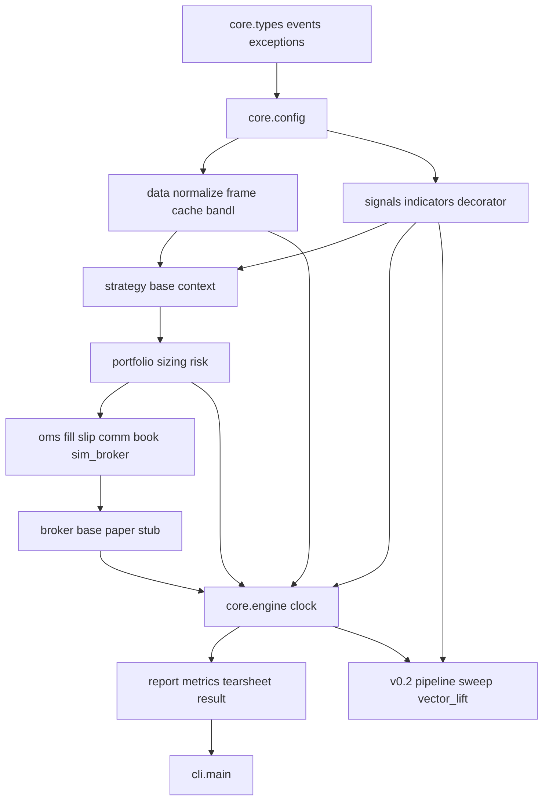

# stolgo — Backtesting Implementation Plan (LLM Executor)

> **Audience:** Junior LLM agent implementing module-by-module.  
> **Source of truth:** [docs/HLD.md](HLD.md), [.cursor/rules/stolgo-engineering.mdc](../.cursor/rules/stolgo-engineering.mdc), [.cursor/rules/stolgo-low-latency.mdc](../.cursor/rules/stolgo-low-latency.mdc), [bandl AGENTS.md](https://github.com/stockalgo/bandl/blob/master/AGENTS.md) (data contract only).  
> **Scope:** Backtesting pillar only — HLD phases **v0.1** + **v0.2**. Live/paper execution, streaming, journal/resume are **out of scope** (interface stubs only).  
> **Hard constraint:** Do **NOT** read, reference, or migrate existing `lib/stolgo/*.py` top-level legacy files (`candlestick.py`, `breakout.py`, etc.). Greenfield subpackages only.

---

## Locked assumptions (do not change without HLD update)

| Assumption | Value | HLD reference |
|------------|-------|---------------|
| Package root | `lib/stolgo/` (matches existing `setup.py` `package_dir`) | — |
| Legacy code | Left on disk; **not imported**, **not exported**, **not deleted** | §13 |
| Default fill | Signal evaluated at bar **close** → market fill at **next bar open** | §5.1, §11 |
| Opt-in same-bar fill | `RunConfig.fill_on="close"` | §5.1 |
| Multi-symbol | **Single-symbol** only in v0.1/v0.2 | §11 #4 |
| `RunConfig.mode` | Only `"backtest"` implemented; `"paper"` / `"live"` raise at engine init | §12 v0.3 |
| Numba | Optional: `RunConfig.fast=True` + `pip install stolgo[numba]` | §7 |
| CI network | **Zero** HTTP in default `pytest`; bandl mocked | §G |
| Reproducibility | `RunConfig.seed: int` drives order IDs and any stochastic paths | §4.1 |

---

## Section A — Repository scaffold

### A.1 Folder tree (every file named)

Create **all** paths below before implementing logic. Empty `__init__.py` files must exist and export only what is listed.

```
lib/stolgo/
  __init__.py
  core/
    __init__.py
    types.py
    events.py
    exceptions.py
    config.py
    clock.py
    engine.py
  data/
    __init__.py
    base.py
    normalize.py
    frame_source.py
    bandl_source.py
    cache.py
  signals/
    __init__.py
    indicators.py
    decorator.py
    pipeline.py                    # v0.2: full impl; v0.1: stub raising NotImplementedError on run()
  strategy/
    __init__.py
    base.py
    context.py
    builtins/
      __init__.py
      trend_breakout.py            # M2 example strategy (not exported from top-level)
  portfolio/
    __init__.py
    portfolio.py
    sizing.py
    risk.py
  oms/
    __init__.py
    fill_model.py
    slippage.py
    commission.py
    order_book.py
    sim_broker.py
  broker/
    __init__.py
    base.py
    paper.py
  report/
    __init__.py
    result.py
    metrics.py
    tearsheet.py
    exporters.py
  cli/
    __init__.py
    main.py

tests/
  conftest.py                      # bandl mock, fixture paths, golden hashes
  fixtures/
    synthetic_100bars.csv
    trend_up_300bars.parquet
    bandl_btcusdt_1h_mock.json
    golden_synthetic_100bars.json  # expected trade_count, final_equity, seed
  test_core_types.py
  test_core_events.py
  test_core_exceptions.py
  test_core_config.py
  test_core_clock.py
  test_data_normalize.py
  test_data_frame_source.py
  test_data_bandl_source.py
  test_data_cache.py
  test_signals_indicators.py
  test_signals_decorator.py
  test_signals_pipeline.py         # v0.2
  test_strategy_base.py
  test_strategy_context.py
  test_portfolio.py
  test_portfolio_sizing.py
  test_portfolio_risk.py
  test_oms_fill_model.py
  test_oms_slippage.py
  test_oms_commission.py
  test_oms_order_book.py
  test_oms_sim_broker.py
  test_broker_base.py
  test_broker_paper.py
  test_engine_backtest.py
  test_engine_sweep.py             # v0.2
  test_report_metrics.py
  test_report_tearsheet.py
  test_report_result.py
  test_cli_run.py

examples/
  trend_breakout_backtest.py       # M2
  vector_momentum_backtest.py      # M5 (v0.2)
  parameter_sweep.py               # M6 (v0.2)

docs/
  IMPLEMENTATION_PLAN_BACKTEST.md    # this file
  HLD.md

pyproject.toml                       # new; see A.3 (migrate from setup.py later, not in v0.1 scope)
```

**Legacy files (do not touch):** `lib/stolgo/candlestick.py`, `breakout.py`, `trend.py`, `samco.py`, `nasdaq.py`, `request.py`, `helper.py`, `exception.py`, `common.py`.

### A.2 Public API exports (`__init__.py`)

| File | `__all__` exports |
|------|-------------------|
| `lib/stolgo/__init__.py` | `Backtest`, `Engine`, `Strategy`, `RunConfig`, `RunResult` |
| `lib/stolgo/core/__init__.py` | `Engine`, `RunConfig`, `RunConfig`, `Bar`, `Order`, `Fill`, `Side`, `OrderType`, `StolgoError`, `DataError`, `LookaheadError`, `ModeNotSupportedError` |
| `lib/stolgo/data/__init__.py` | `DataSource`, `DataFrameSource`, `BandlDataSource`, `normalize_ohlcv` |
| `lib/stolgo/signals/__init__.py` | `sma`, `ema`, `atr`, `donchian`, `rsi`, `indicator`, `Pipeline` (v0.2) |
| `lib/stolgo/strategy/__init__.py` | `Strategy`, `Context` |
| `lib/stolgo/portfolio/__init__.py` | `Portfolio`, `FixedQty`, `PercentEquity`, `RiskPerTrade`, `apply_risk` |
| `lib/stolgo/oms/__init__.py` | `SimBroker`, `NextOpenFill`, `CloseFill`, `BpsSlippage`, `BpsCommission` |
| `lib/stolgo/broker/__init__.py` | `BrokerAdapter`, `PaperBroker` |
| `lib/stolgo/report/__init__.py` | `RunResult`, `Report`, `compute_metrics` |
| `lib/stolgo/cli/__init__.py` | *(empty — entry via console_scripts)* |

**User-facing import (HLD §6.1):**

```python
from stolgo import Backtest, Strategy, RunConfig, RunResult
from stolgo.signals import sma, atr
```

### A.3 `pyproject.toml` (target layout)

Executor creates `pyproject.toml` at repo root. Do **not** remove `setup.py` in v0.1; both may coexist until maintainers migrate.

```toml
[project]
name = "stolgo"
version = "0.2.0"
description = "Lightweight quant-grade backtesting for price-action and factor strategies"
readme = "README.md"
license = { text = "MIT" }
requires-python = ">=3.10"
dependencies = [
    "numpy>=1.24",
    "pandas>=2.0",
    "pydantic>=2.0",
    "bandl>=0.3",
    "plotly>=5.0",
]

[project.optional-dependencies]
numba = ["numba>=0.58"]
polars = ["polars>=0.20"]
kaleido = ["kaleido>=0.2"]   # static PNG/PDF export
dev = [
    "pytest>=7.0",
    "pytest-cov>=4.0",
    "ruff>=0.1",
]

[project.scripts]
stolgo = "stolgo.cli.main:main"

[tool.pytest.ini_options]
testpaths = ["tests"]
markers = [
    "integration: hits real bandl/network (not run in CI)",
    "benchmark: optional perf regression",
]
addopts = "-m 'not integration'"

[tool.ruff]
line-length = 100
target-version = "py310"

[build-system]
requires = ["setuptools>=61"]
build-backend = "setuptools.build_meta"

[tool.setuptools.packages.find]
where = ["lib"]
```

### A.4 Test layout

- **Mirror rule:** `tests/test_<area>_<module>.py` maps to `lib/stolgo/<area>/<module>.py`.
- **Fixtures:** `tests/fixtures/` only; never commit large real market dumps.
- **Golden files:** `tests/fixtures/golden_synthetic_100bars.json` stores `seed`, `trade_count`, `final_equity` (rounded to 6 decimals), `first_trade_entry_ts` for regression.
- **conftest.py:** provides `synthetic_100bars_df`, `mock_bandl_client`, `run_config_defaults`.

### A.5 Fixtures (create with deterministic data)

| File | Rows | Purpose |
|------|------|---------|
| `synthetic_100bars.csv` | 100 | Golden backtest; columns `timestamp,open,high,low,close,volume`; UTC ISO timestamps; monotonic |
| `trend_up_300bars.parquet` | 300 | SMA/trend strategies; gentle uptrend |
| `bandl_btcusdt_1h_mock.json` | 48 | Serialized OHLCV list matching bandl column names for `BandlDataSource` mock |
| `golden_synthetic_100bars.json` | — | Filled after M1 engine lands |

**Fixture generation rule:** use `numpy.random.default_rng(42)` once when generating; never re-randomize in tests.

### A.6 CI command (after every module PR)

```bash
pip install -e ".[dev]"
pytest tests/ -q
ruff check lib/stolgo tests
# grep gates (Section H)
! grep -r "import pandas" lib/stolgo/oms/ lib/stolgo/core/engine.py || true  # engine may import pandas at boundary only
! grep -r "import bandl" lib/stolgo/ --include="*.py" | grep -v "lib/stolgo/data/" | grep -v "lib/stolgo/broker/" || true
```

### A.7 Naming rules (mandatory)

| Kind | Rule | Example |
|------|------|---------|
| Modules | `snake_case.py` | `fill_model.py` not `FillModel.py` |
| Classes | `PascalCase` | `RunConfig`, `SimBroker` |
| Events | `*Event` suffix | `BarEvent`, `FillEvent` |
| Protocols / ABCs | `*Protocol` or ABC + docstring listing implementors | `DataSource`, `BrokerAdapter` |
| Enums | `PascalCase` members `UPPER_SNAKE` | `Side.BUY` |
| Abbreviations | Only domain-standard: `oms`, `pnl`, `ohlcv` | — |
| Private | Leading `_` | `_match_limit` |

---

## Section B — Implementation order (dependency graph)

**Rule:** Do not start step N+1 until step N's test gate is green (`pytest` for all listed test files).

### Build-order diagram



### Step table

| Step | Modules | Test gate (all must pass) | Phase |
|------|---------|---------------------------|-------|
| **1** | `core.types`, `core.events`, `core.exceptions` | `pytest tests/test_core_types.py tests/test_core_events.py tests/test_core_exceptions.py` | v0.1 |
| **2** | `core.config` | `pytest tests/test_core_config.py` | v0.1 |
| **3a** | `data.normalize` | `pytest tests/test_data_normalize.py` | v0.1 |
| **3b** | `data.base`, `data.frame_source` | `pytest tests/test_data_frame_source.py` | v0.1 |
| **3c** | `data.cache` | `pytest tests/test_data_cache.py` | v0.1 |
| **3d** | `data.bandl_source` | `pytest tests/test_data_bandl_source.py` | v0.1 |
| **4** | `signals.indicators`, `signals.decorator` | `pytest tests/test_signals_indicators.py tests/test_signals_decorator.py` | v0.1 |
| **5** | `strategy.base`, `strategy.context` | `pytest tests/test_strategy_base.py tests/test_strategy_context.py` | v0.1 |
| **6** | `portfolio.portfolio`, `portfolio.sizing`, `portfolio.risk` | `pytest tests/test_portfolio*.py` | v0.1 |
| **7a** | `oms.fill_model`, `oms.slippage`, `oms.commission` | `pytest tests/test_oms_fill_model.py tests/test_oms_slippage.py tests/test_oms_commission.py` | v0.1 |
| **7b** | `oms.order_book`, `oms.sim_broker` | `pytest tests/test_oms_order_book.py tests/test_oms_sim_broker.py` | v0.1 |
| **8** | `broker.base`, `broker.paper` | `pytest tests/test_broker_base.py tests/test_broker_paper.py` | v0.1 |
| **9** | `core.clock`, `core.engine` | `pytest tests/test_core_clock.py tests/test_engine_backtest.py` | v0.1 |
| **10** | `report.metrics`, `report.tearsheet`, `report.result`, `report.exporters` | `pytest tests/test_report_*.py` | v0.1 |
| **11** | `cli.main`, `examples/trend_breakout_backtest.py` | `pytest tests/test_cli_run.py` + manual M2 | v0.1 |
| **12** | `signals.pipeline`, engine vector lift, `test_engine_sweep` | `pytest tests/test_signals_pipeline.py tests/test_engine_sweep.py` | **v0.2** |

**v0.1 complete** = steps 1–11 green + M1–M4 milestones (Section E).

**v0.2 complete** = step 12 green + M5–M6 milestones.

---

## Section C — Per-module plans

Each module **must** include the agent mistake checklist comment block (Section D) at the top of every new `.py` file.

---

### C.1 `stolgo.core.types` (HLD §4.1)

**Purpose:** Canonical domain types shared across engine, OMS, portfolio, and report.

**In scope:** `Bar`, `Order`, `Fill`, `Position`, `OrderIntent`, enums (`Side`, `OrderType`, `OrderStatus`), type aliases (`OrderId`, `Symbol`, `Price`, `Qty`).

**Out of scope:** pandas types, broker-native IDs, live streaming types.

**Files:**
```
lib/stolgo/core/types.py
tests/test_core_types.py
```

**Public API (signatures only):**
```python
class Side(str, Enum): BUY = "buy"; SELL = "sell"
class OrderType(str, Enum): MARKET = "market"; LIMIT = "limit"; STOP = "stop"; STOP_LIMIT = "stop_limit"
class OrderStatus(str, Enum): PENDING = "pending"; OPEN = "open"; FILLED = "filled"; CANCELLED = "cancelled"

@dataclass(frozen=True, slots=True)
class Bar:
    ts: int              # UTC nanoseconds since epoch
    open: float
    high: float
    low: float
    close: float
    volume: float
    symbol: str

@dataclass(frozen=True, slots=True)
class Order: ...
@dataclass(frozen=True, slots=True)
class Fill: ...
@dataclass
class Position: ...
@dataclass(frozen=True, slots=True)
class OrderIntent: ...
```

**May import:** `enum`, `dataclasses`, `typing` only.

**Must NOT import:** `pandas`, `numpy` (optional `numpy.typing` only if needed), `bandl`, any `stolgo.*` except nothing.

**Data contracts:** All prices `float` (not `Decimal` in v0.1). Timestamps `int` ns UTC. `Qty > 0` validated at OMS boundary.

**Event / loop contract:** N/A (passive types).

**Test plan:** construct `Bar`; frozen immutability; enum serialization; `OrderIntent` validation rejects zero qty; equality/hash stable.

**Acceptance:** `pytest tests/test_core_types.py`; fully typed public names; docstrings on dataclasses.

**DON'Ts:**
- Don't add pandas `Timestamp` fields on `Bar`.
- Don't use mutable default lists on dataclasses.
- Don't embed strategy tags as dynamic dict without type.
- Don't use `float` for money if you later need currency — document USD/INR notional assumption in docstring only.
- Don't import from legacy `lib/stolgo/exception.py`.

**Rules:** engineering §3 types; low-latency §3 `slots=True` on hot events.

**Size:** S — ≤200 lines total.

---

### C.2 `stolgo.core.events` (HLD §4.1)

**Purpose:** Event envelopes for the deterministic bus and optional `RunResult.events` log.

**In scope:** `BarEvent`, `SignalEvent`, `OrderEvent`, `FillEvent`, `TimerEvent` (TimerEvent logged but not fired in v0.1 loop).

**Out of scope:** `AccountEvent` (live v0.3), WebSocket payloads.

**Files:** `lib/stolgo/core/events.py`, `tests/test_core_events.py`

**Public API:**
```python
@dataclass(frozen=True, slots=True)
class BarEvent:
    bar: Bar
    index: int

@dataclass(frozen=True, slots=True)
class OrderEvent: ...
@dataclass(frozen=True, slots=True)
class FillEvent: ...
@dataclass(frozen=True, slots=True)
class SignalEvent: ...
@dataclass(frozen=True, slots=True)
class TimerEvent: ...
```

**May import:** `stolgo.core.types`.

**Must NOT import:** `pandas`, `bandl`, `strategy`, `oms`.

**Test plan:** event construction; `FillEvent` links `order_id` + `fill`; JSON-serializable via `dataclasses.asdict` for export.

**DON'Ts:** Don't put DataFrames on events. Don't nest mutable lists. Don't create events inside tight loops without reuse where profiling demands.

**Size:** S — ≤150 lines.

---

### C.3 `stolgo.core.exceptions` (HLD §4.1, engineering §6)

**Purpose:** Typed errors with actionable messages.

**In scope:** `StolgoError`, `DataError`, `LookaheadError`, `ConfigurationError`, `OrderRejectedError`, `ModeNotSupportedError`, `BrokerNotImplementedError`.

**Files:** `lib/stolgo/core/exceptions.py`, `tests/test_core_exceptions.py`

**Public API:**
```python
class StolgoError(Exception): ...
class DataError(StolgoError): ...
class LookaheadError(StolgoError): ...
class ModeNotSupportedError(StolgoError): ...
```

**Test plan:** each exception carries `message` with symbol/interval when applicable; inheritance chain.

**DON'Ts:** No bare `except:`. Don't raise generic `ValueError` from core — use typed errors.

**Size:** S — ≤80 lines.

---

### C.4 `stolgo.core.config` (HLD §4.1, §8)

**Purpose:** Single configuration object for reproducible runs.

**In scope:** `RunConfig` pydantic model: `mode`, `seed`, `cash`, `commission`, `slippage_bps`, `fill_on`, `fast`, `symbol`, `interval`.

**Out of scope:** live broker credentials (v0.3).

**Files:** `lib/stolgo/core/config.py`, `tests/test_core_config.py`

**Public API:**
```python
class RunConfig(BaseModel):
    mode: Literal["backtest"] = "backtest"   # paper/live rejected at engine
    seed: int = 42
    cash: float = 100_000.0
    commission: float = 0.0                  # fraction of notional per side
    slippage_bps: float = 0.0
    fill_on: Literal["next_open", "close"] = "next_open"
    fast: bool = False                       # enables numba paths if installed
    model_config = ConfigDict(frozen=True, extra="forbid")

    def params_hash(self) -> str: ...
```

**May import:** `pydantic`, `typing`.

**Must NOT import:** `bandl`, `pandas` (allowed only for validating optional data paths in later extensions — not in v0.1).

**Test plan:** defaults match table above; `extra="forbid"`; `fill_on` invalid raises; `params_hash` stable; frozen immutability.

**DON'Ts:** Don't read env vars inside model (explicit is better). Don't default `mode` to live.

**Size:** S — ≤120 lines.

---

### C.5 `stolgo.data.normalize` (HLD §4.2, §G)

**Purpose:** Validate and normalize user/bandl DataFrames to engine schema.

**In scope:** Column rename map, UTC index, sort, dedupe, NaN check, min rows.

**Out of scope:** corporate actions, split adjustment.

**Files:** `lib/stolgo/data/normalize.py`, `tests/test_data_normalize.py`

**Public API:**
```python
CANONICAL_COLUMNS: tuple[str, ...] = ("open", "high", "low", "close", "volume")

def normalize_ohlcv(
    df: pd.DataFrame,
    *,
    symbol: str | None = None,
    timestamp_col: str = "timestamp",
) -> pd.DataFrame: ...

def bars_from_dataframe(df: pd.DataFrame) -> tuple[Bar, ...]: ...  # cold path at engine start
```

**May import:** `pandas`, `numpy`, `stolgo.core.types`, `stolgo.core.exceptions`.

**Data contracts:** Output index `DatetimeIndex` UTC; columns lowercase `open,high,low,close,volume`; strictly increasing unique index; OHLC finite; `high >= max(open,close,low)`, `low <= min(open,close,high)`.

**Test plan:** happy path; empty df → `DataError`; duplicate timestamps → `DataError`; unsorted → sorted; naive tz → UTC; missing column → `DataError`; NaN in close → `DataError`; bandl-style capitalized columns renamed.

**DON'Ts:** Don't silently drop duplicate rows. Don't forward-fill NaN. Don't use `inplace=True` without returning copy documented.

**Size:** M — ≤250 lines.

---

### C.6 `stolgo.data.base` + `frame_source` (HLD §4.2)

**Purpose:** `DataSource` protocol and in-memory DataFrame provider.

**In scope:** `DataSource.history()`; `DataFrameSource` wrapping normalized frame.

**Out of scope:** `subscribe()` — stub raises `ModeNotSupportedError`.

**Files:** `lib/stolgo/data/base.py`, `lib/stolgo/data/frame_source.py`, `tests/test_data_frame_source.py`

**Public API:**
```python
class DataSource(Protocol):
    def history(
        self,
        symbol: str,
        interval: str,
        start: datetime,
        end: datetime,
    ) -> pd.DataFrame: ...

class DataFrameSource:
    def __init__(self, df: pd.DataFrame, *, symbol: str = "UNKNOWN") -> None: ...
    def history(self, symbol: str, interval: str, start: datetime, end: datetime) -> pd.DataFrame: ...
```

**May import:** `pandas`, `data.normalize`, `core.exceptions`.

**Must NOT import:** `bandl` in `frame_source.py`.

**Test plan:** slice by date range; empty range; symbol mismatch warning or error (pick one, document).

**DON'Ts:** Don't mutate caller's DataFrame without copy flag documented.

**Size:** S — ≤150 lines.

---

### C.7 `stolgo.data.cache` (HLD §4.2)

**Purpose:** Parquet disk cache for bandl fetches.

**In scope:** Key `(provider, symbol, interval, start_iso, end_iso)` → parquet path under `~/.stolgo/cache/` or `RunConfig.cache_dir` if added.

**Out of scope:** distributed cache, Redis.

**Files:** `lib/stolgo/data/cache.py`, `tests/test_data_cache.py`

**Public API:**
```python
class ParquetCache:
    def __init__(self, root: Path | None = None) -> None: ...
    def get(self, key: str) -> pd.DataFrame | None: ...
    def put(self, key: str, df: pd.DataFrame) -> None: ...
    def make_key(self, provider: str, symbol: str, interval: str, start: datetime, end: datetime) -> str: ...
```

**Test plan:** put/get roundtrip; miss returns None; tmp_path fixture; corrupt file → cache miss + log warning (cold path).

**DON'Ts:** Don't cache non-normalized frames. Don't use pickle.

**Size:** S — ≤180 lines.

---

### C.8 `stolgo.data.bandl_source` (HLD §4.2, §G)

**Purpose:** Fetch OHLCV via bandl with cache + normalize.

**In scope:** `BandlDataSource.history()` calling `Bandl().crypto|equity.get_ohlcv_dataframe`.

**Out of scope:** account APIs, live stream.

**Files:** `lib/stolgo/data/bandl_source.py`, `tests/test_data_bandl_source.py`, `tests/fixtures/bandl_btcusdt_1h_mock.json`

**Public API:**
```python
class BandlDataSource:
    def __init__(
        self,
        client: Bandl | None = None,
        *,
        provider: Literal["crypto", "equity"] = "crypto",
        source: str | None = None,   # binance, zerodha, etc.
        cache: ParquetCache | None = None,
    ) -> None: ...
    def history(self, symbol: str, interval: str, start: datetime, end: datetime) -> pd.DataFrame: ...
```

**May import:** `bandl`, `pandas`, `data.cache`, `data.normalize`, `core.exceptions`.

**Must NOT import:** `strategy`, `oms`, `engine`.

**Test plan:** mock client returns fixture JSON → normalized df; cache hit skips client call (mock assert call_count); `start >= end` → `DataError`; no network in test.

**DON'Ts:** Don't call bandl in module import. Don't hardcode API keys. Don't swallow `GeoRestrictionError` — re-raise with hint.

**Size:** M — ≤220 lines.

---

### C.9 `stolgo.signals.indicators` + `decorator` (HLD §4.3, §7)

**Purpose:** Vectorized indicators; metadata for tearsheet panels.

**In scope:** `sma`, `ema`, `atr`, `donchian`, `rsi`; `@indicator` decorator storing `name`, `panel`.

**Out of scope:** candlestick pattern library (future price-action pack).

**Files:** `lib/stolgo/signals/indicators.py`, `lib/stolgo/signals/decorator.py`, tests.

**Public API:**
```python
def sma(close: np.ndarray, period: int) -> np.ndarray: ...
def ema(close: np.ndarray, period: int) -> np.ndarray: ...
def atr(high: np.ndarray, low: np.ndarray, close: np.ndarray, period: int) -> np.ndarray: ...
def donchian(high: np.ndarray, low: np.ndarray, period: int) -> tuple[np.ndarray, np.ndarray]: ...
def rsi(close: np.ndarray, period: int) -> np.ndarray: ...

def indicator(fn: Callable) -> Callable: ...
```

**May import:** `numpy`; optional `numba` behind try/import for `fast` duplicates.

**Must NOT import:** `pandas` in indicator functions (accept `np.ndarray` only).

**Test plan:** SMA known values on constant series; ATR > 0 on volatile fixture; RSI bounds [0,100]; warmup NaNs documented at first `period-1` bars; numba path matches numpy within 1e-10 when `fast=True`.

**DON'Ts:** Don't use `rolling` on full series inside `on_bar`. Don't return pandas Series from indicators. Don't change results when `fast=True` without tolerance test.

**Size:** M — ≤350 lines.

---

### C.10 `stolgo.signals.pipeline` (HLD §4.3, §6.3) — **v0.2**

**Purpose:** Cross-sectional factor screen + rank + rebalance schedule.

**In scope (v0.2):** `Pipeline`, `Factor` base, `add`, `filter`, `rank`, `rebalance`.

**v0.1 stub:** class exists; `run()` raises `NotImplementedError("Pipeline available in stolgo v0.2")`.

**Files:** `lib/stolgo/signals/pipeline.py`, `tests/test_signals_pipeline.py`

**Public API:**
```python
class Factor(ABC):
    def compute(self, frames: dict[str, pd.DataFrame]) -> pd.DataFrame: ...

class Pipeline:
    def __init__(self, universe: list[str] | str) -> None: ...
    def add(self, factor: Factor, *, name: str) -> Pipeline: ...
    def filter(self, mask: pd.Series) -> Pipeline: ...
    def rank(self, column: str, *, top: int) -> Pipeline: ...
    def rebalance(self, rule: str) -> Pipeline: ...
    def run(self, data: DataSource, config: RunConfig) -> RunResult: ...
```

**Test plan (v0.2):** 3-symbol toy universe; weekly rebalance dates; deterministic weights.

**DON'Ts:** Don't implement universe in v0.1. Don't fetch bandl per symbol inside `on_bar`.

**Size:** L — v0.2 only; ≤500 lines.

---

### C.11 `stolgo.strategy.base` (HLD §4.4)

**Purpose:** User-facing strategy ABC.

**In scope:** Hooks `on_start`, `on_bar`, `on_fill`, `on_end`; optional class attrs `entries`, `exits` for vector style.

**Out of scope:** live `on_timer` implementation (engine may no-op in v0.1).

**Files:** `lib/stolgo/strategy/base.py`, `tests/test_strategy_base.py`

**Public API:**
```python
class Strategy(ABC):
    entries: np.ndarray | None = None
    exits: np.ndarray | None = None

    def on_start(self, ctx: Context) -> None: ...
    def on_bar(self, ctx: Context) -> None: ...
    def on_fill(self, ctx: Context, fill: FillEvent) -> None: ...
    def on_end(self, ctx: Context) -> None: ...
```

**May import:** `strategy.context`, `core.events`, `numpy`.

**DON'Ts:** Don't import `bandl`. Don't place orders outside `Context` methods.

**Size:** S — ≤100 lines.

---

### C.12 `stolgo.strategy.context` (HLD §4.4, §5.1)

**Purpose:** Per-bar API: data views, order helpers, position read-only, indicator access.

**In scope:** `ctx.buy`, `ctx.sell`, `ctx.close`, `ctx.data` (masked OHLCV arrays), `ctx.position`, `ctx.i` (bar index).

**Out of scope:** direct broker access.

**Files:** `lib/stolgo/strategy/context.py`, `tests/test_strategy_context.py`

**Public API:**
```python
class Context:
  @property
  def i(self) -> int: ...
  @property
  def data(self) -> BarDataView: ...   # only exposes [:t+1]
  @property
  def position(self) -> Position: ...
  def buy(self, *, qty: float | None = None, size_pct: float | None = None,
          limit: float | None = None, stop: float | None = None, tag: str | None = None) -> OrderIntent: ...
  def sell(self, ...) -> OrderIntent: ...
  def close(self, *, tag: str | None = None) -> OrderIntent: ...
```

**Event contract:** Context constructed with `bar_index=t`; `BarDataView` length = `t+1`; accessing index `> t` raises `LookaheadError`.

**Test plan:** length at t=0 is 1; lookahead raises; buy returns intent not fill; tags propagate to `OrderIntent`.

**DON'Ts:** Don't store reference to full-length arrays on Context. Don't call portfolio mutators from Context.

**Size:** M — ≤300 lines.

---

### C.13 `stolgo.portfolio.portfolio` (HLD §4.5)

**Purpose:** Cash, position, apply fills, mark-to-market equity series.

**In scope:** Long-only v0.1; average cost; realized PnL on close.

**Out of scope:** short selling, margin, multi-currency.

**Files:** `lib/stolgo/portfolio/portfolio.py`, `tests/test_portfolio.py`

**Public API:**
```python
class Portfolio:
    def __init__(self, cash: float) -> None: ...
    def apply_fill(self, fill: Fill) -> None: ...
    def mark_to_market(self, bar: Bar) -> float: ...  # returns equity
    @property
    def position(self) -> Position: ...
    @property
    def cash(self) -> float: ...
```

**Event contract:** Called after `SimBroker.match` yields fills, before `on_bar` (per §5.1).

**Test plan:** buy reduces cash; sell increases; round-trip PnL; equity = cash + qty*close; zero position flat.

**DON'Ts:** Don't compute metrics here. Don't use pandas in `apply_fill`.

**Size:** M — ≤250 lines.

---

### C.14 `stolgo.portfolio.sizing` (HLD §4.5)

**Purpose:** Convert intent to quantity.

**In scope:** `FixedQty`, `PercentEquity`, `RiskPerTrade(stop_distance)`.

**Files:** `lib/stolgo/portfolio/sizing.py`, `tests/test_portfolio_sizing.py`

**Public API:**
```python
def resolve_qty(intent: OrderIntent, portfolio: Portfolio, bar: Bar, config: RunConfig) -> float: ...
```

**Test plan:** percent equity never exceeds cash; risk sizing formula documented in docstring; zero stop distance → `DataError`.

**DON'Ts:** Don't round to lot size in v0.1 (document fractional shares allowed for crypto).

**Size:** S — ≤150 lines.

---

### C.15 `stolgo.portfolio.risk` (HLD §4.5, §5.1)

**Purpose:** Middleware between strategy intents and OMS.

**In scope:** `apply_risk(intent, portfolio, config) -> OrderIntent | None`; `MaxDrawdownCap`, `MaxLeverage` (simple).

**Files:** `lib/stolgo/portfolio/risk.py`, `tests/test_portfolio_risk.py`

**Public API:**
```python
def apply_risk(intent: OrderIntent | None, portfolio: Portfolio, equity_curve: np.ndarray, config: RunConfig) -> OrderIntent | None: ...
```

**Event contract:** Engine calls after `on_bar` returns intents, before OMS submit.

**Test plan:** reject intent when drawdown exceeded; pass-through when within cap.

**DON'Ts:** Don't mutate portfolio. Don't hide rejections — emit `SignalEvent` with `rejected=True` optional flag in v0.2.

**Size:** S — ≤180 lines.

---

### C.16 `stolgo.oms.fill_model` (HLD §4.6)

**Purpose:** Map order + bar → reference fill price.

**In scope:** `NextOpenFill`, `CloseFill`; protocol `FillModel`.

**Files:** `lib/stolgo/oms/fill_model.py`, `tests/test_oms_fill_model.py`

**Public API:**
```python
class FillModel(Protocol):
    def fill_price(self, order: Order, bar: Bar, *, bar_index: int) -> float | None: ...

class NextOpenFill: ...
class CloseFill: ...
```

**Test plan:** market order with next_open uses `bar.open` of fill bar; close uses `bar.close`.

**DON'Ts:** Don't apply slippage here (slippage module does). Don't read future bars.

**Size:** S — ≤120 lines.

---

### C.17 `stolgo.oms.slippage` + `commission` (HLD §4.6)

**Purpose:** Adjust fill price and compute fees.

**Public API:**
```python
class SlippageModel(Protocol):
    def adjust(self, side: Side, price: float, qty: float) -> float: ...

class BpsSlippage: ...

class CommissionModel(Protocol):
    def fee(self, side: Side, price: float, qty: float) -> float: ...

class BpsCommission: ...
class FlatCommission: ...
```

**Test plan:** buy slippage increases price; sell decreases; commission proportional to notional.

**DON'Ts:** Don't double-apply commission on cancel. Don't use random slippage without seed.

**Size:** S each — ≤100 lines per file.

---

### C.18 `stolgo.oms.order_book` (HLD §4.6)

**Purpose:** Resting limit/stop orders indexed for O(1) trigger checks.

**Public API:**
```python
class OrderBook:
    def add(self, order: Order) -> None: ...
    def cancel(self, order_id: OrderId) -> None: ...
    def match(self, bar: Bar) -> list[tuple[Order, float]]: ...  # order, fill_price
```

**Test plan:** limit buy triggers when low <= limit; stop buy when high >= stop; cancel removes.

**DON'Ts:** Don't scan all orders linearly per bar if >100 orders — use price buckets (simple dict ok v0.1).

**Size:** M — ≤200 lines.

---

### C.19 `stolgo.oms.sim_broker` (HLD §4.6, §5.1)

**Purpose:** Backtest matching engine; produces `FillEvent`s.

**In scope:** Market/Limit/Stop; OCO pair cancel; full fill only v0.1; `fill_on` config.

**Out of scope:** partial fills, trailing stops, live routing.

**Files:** `lib/stolgo/oms/sim_broker.py`, `tests/test_oms_sim_broker.py`

**Public API:**
```python
class SimBroker:
    def __init__(
        self,
        fill_model: FillModel,
        slippage: SlippageModel,
        commission: CommissionModel,
        *,
        fill_on: Literal["next_open", "close"] = "next_open",
    ) -> None: ...
    def submit(self, order: Order) -> OrderId: ...
    def cancel(self, order_id: OrderId) -> None: ...
    def match(self, bar: Bar, *, bar_index: int) -> list[FillEvent]: ...
    def open_orders(self) -> list[Order]: ...
```

**May import:** `core.types`, `core.events`, `oms.*` — **not** pandas, bandl, strategy, portfolio.

**Event contract (critical):**
1. Engine calls `match(bar_t)` **before** `Strategy.on_bar`.
2. Intents from `on_bar` enqueue for execution starting bar `t+1` (market) unless `fill_on="close"` for same-bar close fill.
3. Stops/limits evaluated against `bar_t` OHLC during match phase.

**Test plan:** (full list from plan) market BUY next open; limit fill; stop trigger; OCO; commission+slippage; deterministic IDs from seed; no same-bar market fill when `fill_on=next_open`.

**DON'Ts:** (see plan example — 10 bullets) + no PnL in SimBroker.

**Size:** M — ≤450 lines incl tests.

---

### C.20 `stolgo.broker.base` + `paper` (HLD §4.7, §F)

**Purpose:** Preserve sim↔live API surface without implementing live.

**Public API:**
```python
class BrokerAdapter(ABC):
    def place_order(self, intent: OrderIntent) -> str: ...
    def modify_order(self, order_id: str, **kwargs) -> None: ...
    def cancel_order(self, order_id: str) -> None: ...
    def positions(self) -> dict[str, Position]: ...
    def balance(self) -> float: ...
    def subscribe_bars(self, symbol: str, interval: str): ...
    def subscribe_fills(self): ...

class PaperBroker(BrokerAdapter):
    """Stub — raises BrokerNotImplementedError directing users to SimBroker for backtest."""
```

**Test plan:** all methods raise with helpful message; isinstance checks.

**Size:** S — ≤120 lines.

---

### C.21 `stolgo.core.clock` + `engine` (HLD §4.1, §5.1)

**Purpose:** Deterministic bar loop and wiring.

**Files:** `lib/stolgo/core/clock.py`, `lib/stolgo/core/engine.py`, `tests/test_core_clock.py`, `tests/test_engine_backtest.py`

**Public API:**
```python
class SimClock:
    def __init__(self, bars: Sequence[Bar]) -> None: ...
    def __iter__(self) -> Iterator[tuple[int, Bar]]: ...

class Engine:
    def __init__(self, config: RunConfig) -> None: ...
    def run(self, strategy: Strategy, data: pd.DataFrame | DataSource) -> RunResult: ...

class Backtest:
    def __init__(self, strategy: Strategy, data: pd.DataFrame | DataSource, **kwargs: Any) -> None: ...
    def run(self) -> RunResult: ...
```

**Per-bar ordering (engine MUST enforce):**
```
for t, bar in clock:
    fills = sim_broker.match(bar, bar_index=t)
    for f in fills: portfolio.apply_fill(f); strategy.on_fill(ctx, f)
    equity[t] = portfolio.mark_to_market(bar)
    strategy.on_bar(ctx_t)          # ctx_t masked to [:t+1]
    intents = ctx.consume_intents()
    for intent in apply_risk(...):
        sim_broker.submit(convert(intent))   # effective t+1 unless fill_on=close
```

**v0.2 vector lift:** if `strategy.entries`/`exits` set in `on_start`, engine generates intents from masks at each `t` without requiring `on_bar` body.

**Test plan:** golden `synthetic_100bars`; lookahead monkeypatch; `mode="live"` config rejected at `Engine.__init__`; empty data; single bar; no trades → flat equity.

**DON'Ts:** Don't pass full DataFrame to strategy. Don't call `on_bar` before match. Don't reset RNG in loop.

**Size:** L — engine ≤400 lines; split PR: skeleton (step 9a), vector lift (step 12).

---

### C.22 `stolgo.report.*` (HLD §4.8, §8)

**Purpose:** `RunResult`, metrics, Plotly tearsheet, exporters.

**Files:** `result.py`, `metrics.py`, `tearsheet.py`, `exporters.py`, tests.

**Public API:**
```python
@dataclass
class RunResult:
    params: dict[str, Any]
    trades: pd.DataFrame
    equity: pd.Series
    positions: pd.DataFrame
    signals: pd.DataFrame
    events: list[BarEvent | FillEvent | ...]
    metrics: dict[str, float]
    report: Report

    def to_dict(self) -> dict: ...
    def to_json(self, path: Path) -> None: ...

class Report:
    def show(self) -> None: ...       # opens browser / displays in notebook
    def to_html(self, path: Path) -> None: ...

def compute_metrics(equity: pd.Series, trades: pd.DataFrame) -> dict[str, float]: ...
```

**Metrics required v0.1:** `total_return`, `cagr`, `sharpe`, `sortino`, `calmar`, `max_drawdown`, `max_drawdown_duration`, `volatility`, `hit_rate`, `expectancy`, `profit_factor`, `num_trades`, `exposure_pct`, `turnover`.

**Charts v0.1:** equity, drawdown, price+trade markers (minimum); heatmap optional v0.2.

**Test plan:** metrics on known equity curve; HTML contains plotly div; JSON roundtrip; zero trades → NaN-safe metrics.

**DON'Ts:** Don't compute metrics inside engine loop. Don't require Kaleido for default tests.

**Size:** L — ≤600 lines across report package.

---

### C.23 `stolgo.cli.main` (HLD §4.9)

**Purpose:** `stolgo run strategy.py --data fixture.csv`.

**In scope:** argparse, load strategy class by name, run backtest, write HTML report path.

**Out of scope:** `stolgo paper`, live.

**Files:** `lib/stolgo/cli/main.py`, `tests/test_cli_run.py`

**Public API:** `def main(argv: list[str] | None = None) -> int: ...`

**Test plan:** subprocess or CliRunner equivalent; `--help`; run on synthetic fixture produces output file.

**Size:** S — ≤150 lines.

---

## Section D — Global agent mistake prevention registry

Read this section **before every module**.

| Mistake category | Wrong | Right |
|------------------|-------|-------|
| Look-ahead bias | `rolling()` or signals using future rows at bar `t` | Precompute vectorized series; index at `t`; mask ctx to `[:t+1]` |
| Bar ordering | Assume sorted unique index | Validate + sort explicitly; error on duplicates |
| Timezones | Naive datetime | UTC-aware everywhere; document assumption |
| Over-engineering | Abstract factories, plugin registries in v0.1 | Simple functions/classes until 2nd variant exists |
| Layer violations | `strategy` imports `bandl` | Only `stolgo.data` / `stolgo.broker` adapters touch bandl |
| Hot path | `iterrows()`, per-bar DataFrame slice | NumPy arrays preallocated; O(1) index in loop |
| Fill timing | Fill at signal bar close by default | Default: signal at close → fill at **next bar open** (`RunConfig.fill_on`) |
| Globals | Module-level mutable cache | Pass config/objects; no hidden state |
| Tests | Mock everything / no fixtures | Deterministic CSV fixtures; assert known trade count & equity |
| Scope creep | Implement live streaming, real broker orders | Stub `BrokerAdapter`; implement `SimBroker` only |
| API drift | Invent APIs not in HLD | Match HLD public API names exactly |
| Old code | Copy from `lib/stolgo/*.py` | Greenfield only |

### Mandatory file header (copy into every new `lib/stolgo/**/*.py` file)

```python
# stolgo agent mistake checklist — docs/IMPLEMENTATION_PLAN_BACKTEST.md §D
# [ ] no look-ahead: only data[:t+1] in strategy loop
# [ ] no pandas in oms/portfolio hot path
# [ ] no bandl imports outside stolgo.data / stolgo.broker
# [ ] fill default = next_open unless RunConfig.fill_on == "close"
# [ ] pytest tests for this module pass before next build step
```

---

## Section E — Backtest end-to-end milestones

| Milestone | User can run | Proves | Guard test |
|-----------|--------------|--------|------------|
| **M1** | `pytest tests/test_engine_backtest.py::test_synthetic_100bars_golden -q` | Engine + portfolio + SimBroker wired | `test_engine_backtest.py` |
| **M2** | `python examples/trend_breakout_backtest.py` | HLD §6.1 strategy + signals + sizing | Manual + `test_engine_backtest.py::test_trend_breakout` |
| **M3** | `python -c "from examples..."` or example calls `result.report.show()` | Plotly tearsheet | `tests/test_report_tearsheet.py` |
| **M4** | `pytest tests/test_data_bandl_source.py -q` | Bandl adapter + cache, no network | `test_data_bandl_source.py` |
| **M5** | `python examples/vector_momentum_backtest.py` | Vector lift (HLD §6.2) | `test_engine_backtest.py::test_vector_lift_parity` |
| **M6** | `python examples/parameter_sweep.py` | 100 combos, optional numba | `tests/test_engine_sweep.py` |

### M1 — expected output shape

```python
result = Backtest(NoOpStrategy(), df, cash=100_000, seed=42).run()
assert isinstance(result, RunResult)
assert len(result.equity) == len(df)
assert "total_return" in result.metrics
```

Golden: `trade_count`, `final_equity` match `tests/fixtures/golden_synthetic_100bars.json`.

### M2 — expected stdout

```
total_return=...
sharpe=...
num_trades=N
```

`N >= 0`; finite metrics.

### M3 — HTML assertions

`test_report_tearsheet.py` parses generated HTML contains `"plotly"` and trace names `equity`, `drawdown`.

### M6 — performance gate (optional CI job)

`pytest tests/test_engine_sweep.py -m benchmark` completes 100 combos on `trend_up_300bars.parquet` in <30s with numba extra installed; skip if numba missing.

---

## Section F — Stubs for live phase (interfaces only)

### F.1 `BrokerAdapter` (7 methods)

| Method | Returns | v0.1 behaviour |
|--------|---------|----------------|
| `place_order` | `str` (broker order id) | `raise BrokerNotImplementedError` |
| `modify_order` | `None` | raise |
| `cancel_order` | `None` | raise |
| `positions` | `dict[str, Position]` | raise |
| `balance` | `float` | raise |
| `subscribe_bars` | `Iterator[Bar]` | raise |
| `subscribe_fills` | `Iterator[Fill]` | raise |

Docstring on ABC: *"Implementors: BandlBroker (v0.3), custom brokers via entry point (v1.0)."*

### F.2 `RunConfig.mode` guard

In `Engine.__init__`:

```python
if config.mode != "backtest":
    raise ModeNotSupportedError(
        "live/paper mode not implemented until v0.3; see docs/HLD.md §12"
    )
```

### F.3 `PaperBroker`

```python
class PaperBroker(BrokerAdapter):
    """Stub for future paper trading. Use SimBroker inside Engine for backtests."""
```

All methods raise:

`BrokerNotImplementedError("PaperBroker is not available in v0.1. Run Backtest(...).run() with SimBroker.")`

---

## Section G — bandl integration (backtest only)

### G.1 Wrapper contract

```python
# BandlDataSource.history() implementation sketch (signatures only)
def history(self, symbol: str, interval: str, start: datetime, end: datetime) -> pd.DataFrame:
    key = cache.make_key(self._source or "default", symbol, interval, start, end)
    hit = cache.get(key)
    if hit is not None:
        return hit
    if self._provider == "crypto":
        raw = self._client.crypto.get_ohlcv_dataframe(symbol, interval, start, end, source=self._source)
    else:
        raw = self._client.equity.get_ohlcv_dataframe(symbol, interval, start, end, source=self._source)
    df = normalize_ohlcv(raw, symbol=symbol)
    cache.put(key, df)
    return df
```

**Interval strings:** accept bandl `Interval` enum values or strings (`"1h"`, `"1d"`) — map in adapter, document table in module docstring.

### G.2 Normalization rules

| Rule | Action |
|------|--------|
| Timestamp | Parse to UTC; set as index |
| Columns | Lowercase; map `Open`→`open`, etc. |
| Sort | Ascending by time |
| Duplicates | `DataError` with duplicate timestamp list (max 5 shown) |
| NaN OHLC | `DataError` with row index |
| `start >= end` | `DataError` |

### G.3 CI mock (no network)

`tests/conftest.py`:

```python
@pytest.fixture
def mock_bandl_client():
    class _MockFacet:
        def get_ohlcv_dataframe(self, symbol, interval, start, end, **kw):
            return pd.read_json(FIXTURE_DIR / "bandl_btcusdt_1h_mock.json")
    class _Mock:
        crypto = _MockFacet()
        equity = _MockFacet()
    return _Mock()
```

Default pytest: `addopts = "-m 'not integration'"`. Integration tests optional with real keys in env.

### G.4 bandl RFC notes (do NOT implement in stolgo v0.1)

Record in `docs/HLD.md` §9.3 only; stolgo issues/tracker links optional:

1. `client.execution` facet — place/cancel/modify/positions/balance  
2. `client.stream` facet — `subscribe_bars`, `subscribe_fills`  
3. `client_order_id` on all orders  
4. `dry_run=True` for paper  
5. `BrokerCapabilities` matrix  
6. Reuse `AccountOrder` / `AccountFill` models  

---

## Section H — Definition of done (whole backtest phase)

### H.1 Module checklist

- [ ] All build steps 1–11 (v0.1) and step 12 (v0.2) complete in order  
- [ ] Every module has Section C plan implemented  
- [ ] Every new file has §D header comment block  
- [ ] `pytest tests/ -q` green, no network  
- [ ] Examples run: `trend_breakout_backtest.py`, `vector_momentum_backtest.py`, `parameter_sweep.py`  
- [ ] HLD §6.1 (event) and §6.2 (vector) strategies both work  
- [ ] Tearsheet HTML: equity, drawdown, trade markers present  
- [ ] README: **"Quickstart backtest"** section only (no live docs)  
- [ ] **No imports** from legacy `lib/stolgo/candlestick.py` etc.  
- [ ] No `import bandl` outside `lib/stolgo/data/` and `lib/stolgo/broker/`  
- [ ] No `import pandas` inside `lib/stolgo/oms/` (grep CI gate)  
- [ ] Public APIs typed; docstrings on public classes/functions  
- [ ] Golden regression `golden_synthetic_100bars.json` committed and passing  

### H.2 CI grep gates

```bash
# bandl isolation
if grep -r "import bandl\|from bandl" lib/stolgo --include="*.py" | grep -v "lib/stolgo/data/" | grep -v "lib/stolgo/broker/"; then
  echo "FAIL: bandl import outside data/broker"; exit 1
fi

# pandas in OMS hot package
if grep -r "import pandas\|from pandas" lib/stolgo/oms --include="*.py"; then
  echo "FAIL: pandas in oms"; exit 1
fi
```

### H.3 README Quickstart (content requirements only)

Executor adds section with:

1. `pip install stolgo bandl`  
2. Load CSV or bandl dataframe  
3. Subclass `Strategy`, `Backtest(...).run()`, `result.report.show()`  
4. Link to `docs/HLD.md` and this implementation plan  

**Do not** document `Live()`, paper trading, or streaming until v0.3.

---

## Appendix — PR discipline

| Rule | Value |
|------|-------|
| One module per PR | ≤400 lines changed (prod + tests) |
| PR title | `feat(backtest): <module> — step N` |
| PR body | Lists HLD §, tests added, mistake checklist confirmed |
| Before merge | `pytest` + ruff + grep gates |

---

*End of implementation plan. Executor: start at Section B step 1; do not skip test gates.*
